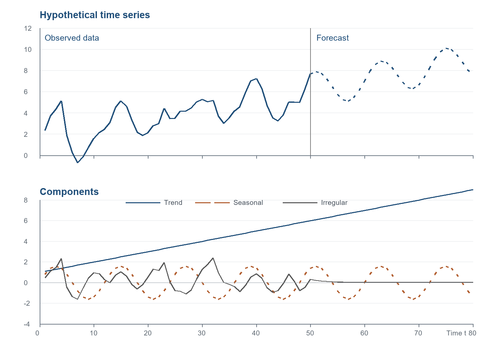

# 第 1 章 差分方程

## 导言

经济活动总是在时间中展开。今天的产出、价格、消费、投资和汇率，通常不是孤立决定的；它们既受当前信息影响，也保留着过去状态的痕迹。一个季度的收入会影响下一季度的消费，一个时期的价格会影响下一时期的供给，今天的资产价格则反映市场对未来信息的重新评价。时间序列计量经济学的出发点，正是要用可估计的模型描述这种动态联系。

在早期研究中，时间序列分析主要服务于预测。研究者常把一个序列分解为趋势、季节、周期和不规则成分。趋势反映序列的长期方向；季节和周期成分刻画有规律的反复波动；不规则成分则代表不能由确定性规律完全解释的部分。若这些成分能够被识别出来，预测似乎就可以通过延伸趋势、重复季节波动、并估计不规则成分的短期持续性来完成。

现代时间序列分析保留了这种分解思想，但不再把各成分简单看作确定性函数。趋势可以是随机的，季节波动可以随时间变化，不规则成分也可能存在相关性和条件异方差。因此，时间序列计量经济学并不只是对历史曲线作机械外推，而是试图寻找驱动序列变化的“运动方程”。所谓运动方程，就是说明一个变量在某一时期的取值如何由过去取值、时间、其他变量以及随机冲击共同决定。

设已经观察到某一序列前 50 期的数值，并希望预测第 51 期以后。为说明基本思想，可把该序列写成三个成分之和：

```         
yₜ = Tₜ + Sₜ + Iₜ
```

其中 Tₜ 表示趋势成分，Sₜ 表示季节成分，Iₜ 表示不规则成分。图 1.1 所依据的一个简单设定为：

```         
趋势：Tₜ = 1 + 0.1t
季节：Sₜ = 1.6 sin(tπ/6)
不规则项：Iₜ = 0.7Iₜ₋₁ + εₜ
```

趋势项使序列的平均水平随时间上升；季节项使序列出现固定周期的起伏；不规则项虽然没有确定的形状，却并非完全不可预测。由于 Iₜ 与 Iₜ₋₁ 有关，若某一期出现较大的正扰动，下一期仍倾向于保持正值；若某一期出现较大的负扰动，下一期也倾向于继续偏低。不过，只要新的随机扰动 εₜ 的期望为零，且系数 0.7 的绝对值小于 1，不规则项的影响就会随时间逐渐衰减。



**图 1.1 假想时间序列。** 上图以第 1—50 期作为观测期，第 51—80 期作为预测期；下图分别给出趋势、季节和不规则成分。预测时将未来新随机扰动的期望设为零，因此不规则成分逐渐向零衰减。图形依据本节方程重建；由于原书未给出每一期 εₜ 的具体数值，观测期的不规则项使用固定模拟冲击，并非原书逐点复刻。

上述三个方程已经体现了本章的核心概念：时间序列模型本质上是差分方程。差分方程把某一时期的变量表示为过去变量、时间和其他因素的函数。在最一般的意义上，可以写作：

```         
yₜ = f(yₜ₋₁, yₜ₋₂, …, t, xₜ, xₜ₋₁, …, εₜ)
```

这一定义强调两点。第一，时间序列模型关心的是变量如何从一个时期过渡到下一个时期，而不只是同一时期变量之间的静态关系。第二，随机冲击进入方程以后，模型描述的不再是一条完全确定的路径，而是一个随机过程。给定初始值和未来冲击的假设，模型可以生成变量的未来路径；反过来，给定实际数据，计量经济学的任务就是估计这条运动方程的参数，并检验它是否符合经济理论。

因此，Enders 从差分方程开始讨论时间序列，并不是为了先讲一套抽象数学技巧，而是为了确立全书共同的语言。随机游走、结构式与简化式、误差修正模型以及非线性动态模型，看似属于不同主题，实质上都在回答同一个问题：一个经济变量的现在，如何由它的过去和新的冲击共同形成。

**本节小结。** 时间序列分析的对象不是静止的相关关系，而是随时间展开的动态过程。差分方程提供了描述这种过程的基本形式：它把历史状态、确定性成分和随机冲击统一到同一个模型框架中。掌握这一点，后续的预测、检验和经济解释才有共同基础。

------------------------------------------------------------------------

## 1 时间序列模型

### 1.1 随机游走假说

资产价格是理解随机差分方程的自然例子。令 yₜ 表示第 t 日某股票价格的对数。若市场有效，投资者不能仅凭已知信息获得可持续的超额收益。换言之，如果人们已经知道明天买入股票能够获得确定的资本利得，那么今天就会有人买入并推高当前价格；相反，如果人们预期股票将下跌，也没有人愿意按当前价格持有它。

这一思想可以写成最简单的随机游走模型：

```         
yₜ₊₁ = yₜ + εₜ₊₁
```

或等价地写作：

```         
Δyₜ₊₁ = εₜ₊₁
```

其中 Δyₜ₊₁ = yₜ₊₁ − yₜ，εₜ₊₁ 是从 t 期信息看均值为零的随机扰动。该模型并不意味着价格不变，而是意味着价格变化没有可由当前信息系统预测的部分。明天的价格可以上升，也可以下降；但这种变化应当来自新的信息，而不是来自今天已经被市场知道的信息。

为了使假说可以被经验检验，可考虑更一般的回归式：

```         
Δyₜ₊₁ = a₀ + a₁yₜ + εₜ₊₁
```

随机游走假说要求：

```         
a₀ = 0，a₁ = 0，且 Eₜ(εₜ₊₁) = 0
```

若 a₀ 不为零，价格变化存在平均漂移；若 a₁ 不为零，当前价格水平对未来变化具有预测能力；若 εₜ₊₁ 能由 t 期信息预测，则新息并不是真正的新息。这些情形都会削弱最简单的随机游走假说。

这个例子说明，经济理论往往直接给出关于时间路径的可检验含义。有效市场理论不是只说“价格由供求决定”，而是进一步要求价格变化的条件均值应为零。时间序列计量经济学的任务，就是把这种动态含义写成差分方程，并用数据检验其中的限制条件。

**本节小结。** 随机游走模型是最简单的随机差分方程之一。它强调，若市场已经充分吸收当前信息，则未来价格变化应表现为不可预测的新冲击。由此可见，差分方程不仅用于预测，也用于把经济理论转化为可检验命题。

### 1.2 结构式方程与简化式方程

许多经济理论并不只涉及一个变量，而是涉及多个变量的同时决定。为说明结构式和简化式的区别，考虑 Samuelson 的收入—消费—投资系统：

```         
yₜ = cₜ + iₜ                                      （1.1）

cₜ = αyₜ₋₁ + εcₜ，0 < α < 1                       （1.2）

iₜ = β(cₜ − cₜ₋₁) + εiₜ，β > 0                    （1.3）
```

其中 yₜ、cₜ 和 iₜ 分别表示实际产出、消费和投资。式（1.1）是收入恒等式：总产出等于消费和投资之和。式（1.2）表示消费由上一期收入决定，并受到消费扰动 εcₜ 的影响。式（1.3）体现加速数原理：消费增加意味着经济需要更多资本存量，因此会引致新增投资。

在这一系统中，yₜ、cₜ 和 iₜ 是内生变量；yₜ₋₁ 和 cₜ₋₁ 是预定变量。式（1.3）把当期投资写成当期消费的函数，因此是结构式方程。结构式方程的优点是经济含义清楚：它试图刻画消费、投资和产出之间的行为关系。它的困难在于，右侧含有当期内生变量，因而不便直接作为单方程预测模型。

简化式方程则把一个变量表示为自身滞后、其他内生变量的滞后、外生变量和扰动项的函数。消费方程（1.2）已经是简化式，因为右侧只含滞后收入和当前扰动。投资方程可以通过代入得到简化式。将（1.2）代入（1.3），有：

```         
iₜ = β(αyₜ₋₁ + εcₜ − cₜ₋₁) + εiₜ
   = αβyₜ₋₁ − βcₜ₋₁ + βεcₜ + εiₜ
```

再由滞后一期的消费方程：

```         
cₜ₋₁ = αyₜ₋₂ + εc,ₜ₋₁
```

可得：

```         
iₜ = αβ(yₜ₋₁ − yₜ₋₂) + β(εcₜ − εc,ₜ₋₁) + εiₜ        （1.4）
```

同理，将消费和投资的表达式代入收入恒等式，可得产出的单变量简化式：

```         
yₜ = α(1 + β)yₜ₋₁ − αβyₜ₋₂ + xₜ                    （1.5）
```

其中：

```         
xₜ = (1 + β)εcₜ + εiₜ − βεc,ₜ₋₁
```

式（1.5）说明，当期产出可以由过去两期产出和复合扰动项表示。对预测而言，这种形式极为方便：只要估计出滞后系数，并观察到历史产出，就可以递推预测未来产出。对经济解释而言，仅有简化式还不够，因为 α 和 β 是结构参数，代表消费倾向和加速数。若要从简化式恢复这些结构参数，必须依赖额外的理论限制或识别条件。

需要注意，简化式并不一定唯一。不同的代入顺序、不同的变量消去方式，可能得到形式不同但经济含义一致的表达式。预测通常偏好简化式，因为它直接连接历史数据与未来数值；结构分析则更关心原始行为方程，因为政策含义往往来自结构参数。

**本节小结。** 结构式方程强调经济机制，简化式方程强调可估计和可预测。二者不是竞争关系，而是同一动态系统的两种表达方式。理解它们的转换关系，有助于区分“预测一个变量”和“解释一个经济机制”这两类不同任务。

### 1.3 误差修正：远期价格与即期价格

许多经济变量之间存在长期均衡关系，但短期内会偏离均衡。误差修正模型正是用来描述这种情形：变量短期如何波动，以及偏离长期关系后如何调整。

设 sₜ 为 t 期即期外汇价格，fₜ 为 t 期签约、下一期交割的远期外汇价格。若投机者在 t 期买入远期外汇，并在 t+1 期收到外汇后按即期价格卖出，则每单位收益为：

```         
sₜ₊₁ − fₜ
```

无偏远期汇率假说认为，这种投机交易的预期收益应为零。因此有：

```         
sₜ₊₁ = fₜ + εₜ₊₁                                  （1.6）
```

其中从 t 期信息看：

```         
Eₜ(εₜ₊₁) = 0
```

于是，远期价格 fₜ 是下一期即期价格 sₜ₊₁ 的无偏预测。相应的经验检验可写成：

```         
sₜ₊₁ = a₀ + a₁fₜ + εₜ₊₁
```

若 a₀ = 0、a₁ = 1，且残差在 t 期信息集下不可预测，则无偏远期汇率假说未被拒绝。

当 sₜ₊₁ = fₜ 时，即期市场与远期市场处于长期均衡。若二者不相等，就出现了偏离均衡的误差。设后续调整过程为：

```         
sₜ₊₂ = sₜ₊₁ − α(sₜ₊₁ − fₜ) + εs,ₜ₊₂，α > 0          （1.7）

fₜ₊₁ = fₜ + β(sₜ₊₁ − fₜ) + εf,ₜ₊₁，β > 0            （1.8）
```

若 sₜ₊₁ 高于 fₜ，则差额 sₜ₊₁ − fₜ 为正。式（1.7）说明即期价格随后倾向于下降，式（1.8）说明远期价格倾向于上升。二者共同缩小偏离，使市场重新接近长期均衡。

误差修正模型的关键思想是：短期变化取决于上一期偏离长期均衡的程度。它不同于只研究差分变化的模型，因为它保留了变量之间的长期关系；也不同于纯粹的长期均衡模型，因为它明确刻画了偏离均衡后的调整过程。

**本节小结。** 误差修正模型把长期均衡与短期动态连接起来。若变量之间存在稳定的长期关系，短期偏离就不应被视为无结构的随机波动，而应成为下一期调整的重要解释变量。

### 1.4 非线性动态

前面的例子大多是线性的：变量以一次方形式进入方程，系数保持不变。线性模型便于估计和解释，也是时间序列分析的基本起点。然而，许多经济调整具有非对称性。经济主体面对上升和下降、繁荣和衰退、扩张和收缩时，反应未必相同。

仍以投资方程为例。式（1.3）假定投资对消费增加和消费减少的反应由同一个系数 β 决定。但现实中，企业在需求上升时可能迅速扩张产能；在需求下降时，却可能先降低开工率、推迟设备更新，而不是立即减少资本存量。因此，投资对消费上升的反应可能强于对消费下降的反应。

这种非对称性可写为：

```         
iₜ = β₁(cₜ − cₜ₋₁) − λₜβ₂(cₜ − cₜ₋₁) + εiₜ
```

其中 β₁ \> β₂ \> 0，且：

```         
λₜ = 0，当 cₜ − cₜ₋₁ ≥ 0
λₜ = 1，当 cₜ − cₜ₋₁ < 0
```

于是，当消费增加时：

```         
iₜ = β₁(cₜ − cₜ₋₁) + εiₜ
```

当消费减少时：

```         
iₜ = (β₁ − β₂)(cₜ − cₜ₋₁) + εiₜ
```

由于 β₁ − β₂ 小于 β₁，投资对消费下降的反应弱于对消费上升的反应。这里的非线性并不来自复杂的数学形式，而来自经济行为规则的改变：同一变量在不同状态下具有不同边际影响。

非线性动态提醒我们，线性模型虽然重要，却不应成为理解经济时间序列的唯一框架。当经济调整存在门槛、制度约束、菜单成本或预期转换时，参数可能随状态变化而变化。模型能否刻画这种状态依赖性，直接影响预测和政策分析的可靠性。

**本节小结。** 非线性模型扩展了线性时间序列的表达能力。它允许经济变量在不同状态下遵循不同的调整规则，从而更贴近许多实际经济过程。但也正因为如此，非线性模型需要更清楚的理论动机和更谨慎的经验识别。

------------------------------------------------------------------------

## 本章小结

本章以差分方程为起点，说明时间序列计量经济学的基本问题：如何用方程描述经济变量的动态路径。差分方程把当前变量与过去变量、确定性成分和随机冲击联系起来，因此既可以用于预测，也可以用于检验经济理论。

随机游走模型说明，某些经济理论直接要求变量变化不可预测；结构式与简化式的转换说明，同一个经济系统可以分别服务于机制解释和经验预测；误差修正模型说明，短期变化可以由长期均衡偏离所驱动；非线性动态则说明，经济主体在不同状态下可能遵循不同的调整规则。

这些例子共同表明，时间序列模型的核心不是曲线拟合，而是动态建模。一个好的时间序列模型必须说明三件事：变量记住了哪些过去信息，新的随机冲击如何进入系统，以及经济理论对这一路径施加了哪些可检验限制。后续章节中的 ARMA 模型、单位根检验、趋势分析、多变量系统和协整模型，都可以看作这一基本思想的进一步展开。

## 思考题

1.  为什么说时间序列预测不是简单地把历史曲线向后延伸？请结合图 1.1 说明。
2.  在随机游走模型中，“价格变化不可预测”与“价格没有风险”是否等价？为什么？
3.  结构式方程和简化式方程分别适合回答什么类型的问题？
4.  在远期汇率例子中，为什么 sₜ₊₁ − fₜ 可以被称为偏离长期均衡的误差？
5.  试举一个经济变量可能具有非线性动态的例子，并说明其经济原因。
