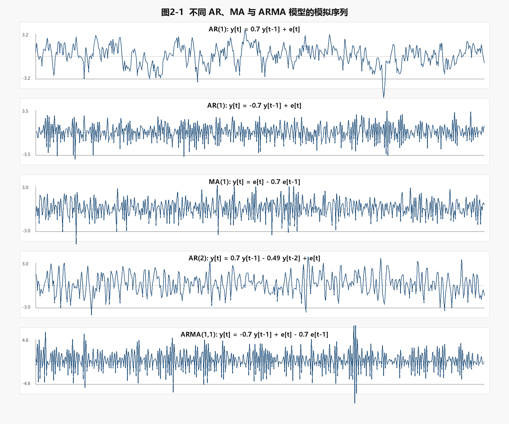
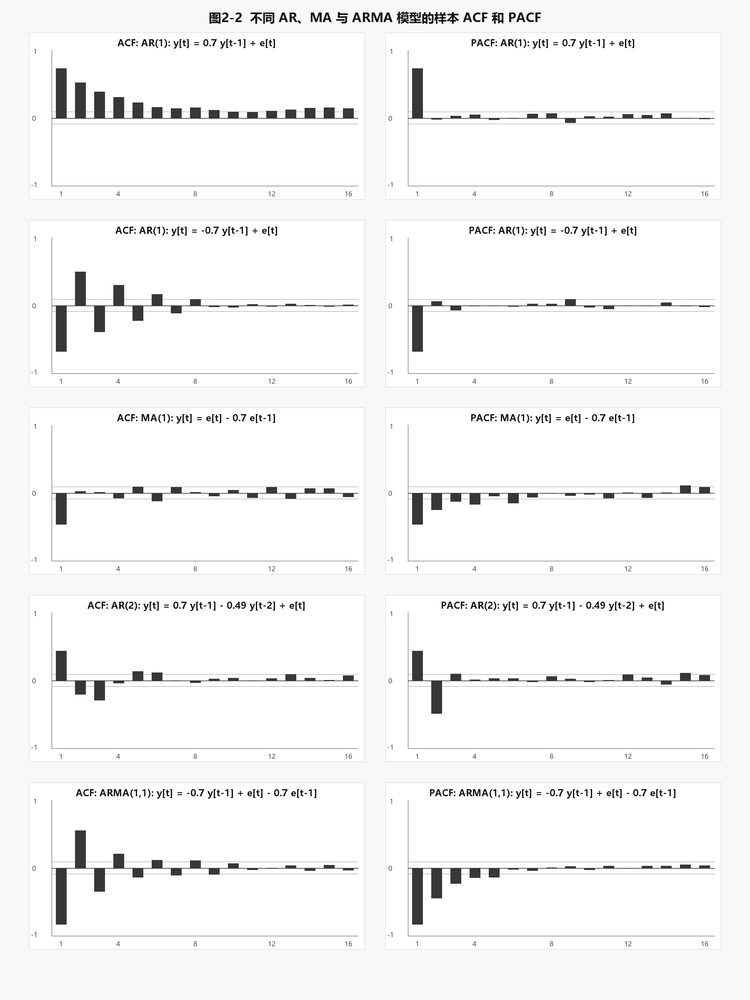
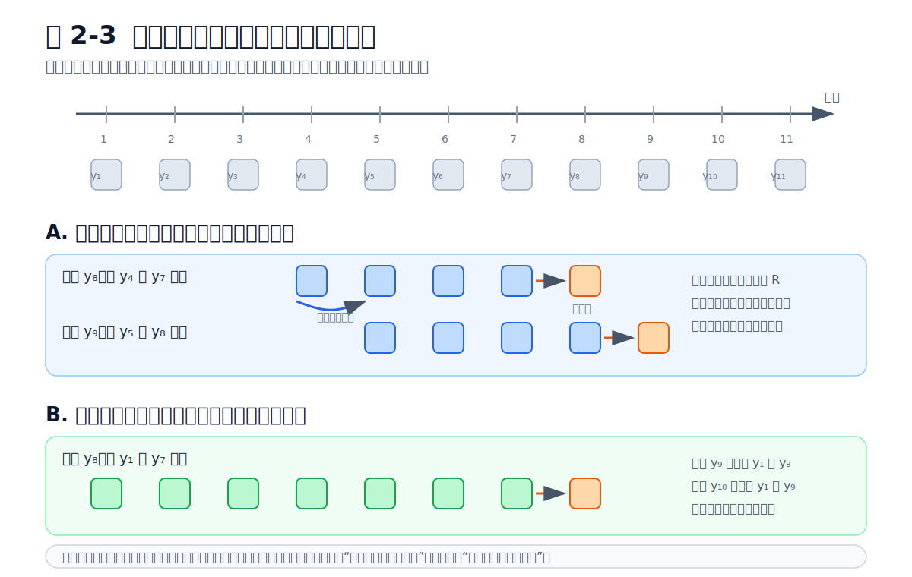

# 第 2 章  平稳时间序列模型

## 导言

第 1 章说明，经济时间序列模型本质上是在估计含有随机成分的差分方程。一个变量的当前取值，往往由它的过去取值、过去冲击以及当前新信息共同决定。第 2 章在这一基础上讨论最基本的一类时间序列模型：单变量平稳时间序列模型。

所谓单变量模型，是指只用一个变量自身的历史信息来刻画它的动态过程。若研究对象是通货膨胀率、利率变动、股票收益率、农产品价格增长率或工业增加值增长率，研究者常常首先问：这个变量是否存在可利用的自身动态规律？今天的高值是否预示明天仍然偏高？一次冲击会持续多久？序列最终是否会回到某个稳定水平？这些问题构成了本章的基本内容。

所谓平稳时间序列模型，是指模型所描述的随机过程具有稳定的概率结构。平稳性并不意味着序列没有波动，也不意味着每一期取值相同；它意味着序列的均值、方差和自相关结构不随时间系统性改变。只有在这种条件下，我们才有理由用历史样本中估计出来的动态关系去解释和预测未来。

本章重点讨论三类模型：自回归模型 AR、移动平均模型 MA 和二者结合而成的 ARMA 模型。它们是 Box-Jenkins 时间序列建模方法的核心，也是理解之后 ARIMA、单位根检验、VAR、协整和波动率模型的基础。

本章的主线可以概括为四步：先定义平稳性，再用自相关函数描述序列的动态结构，然后建立 AR、MA 和 ARMA 模型，最后讨论模型识别、估计、诊断、结构稳定性检验和预测。

**本节小结。** 单变量平稳模型研究的是一个变量如何由自身过去和过去冲击所决定。平稳性使历史规律具有可重复性，是使用 AR、MA 和 ARMA 模型进行解释与预测的前提。

---

## 2.1 平稳性的含义

时间序列数据是一段已经实现的历史路径。例如，我们可以观察到 2000 年第 1 季度到 2025 年第 4 季度的 GDP 增长率，也可以观察到某种农产品每日价格的变化率。这一条实际路径称为时间序列样本。样本背后所假定的随机生成机制，称为随机过程。

为了从一条有限样本中推断总体规律，必须对随机过程作出某种稳定性假设。平稳性正是最重要的稳定性假设。若一个随机过程的概率结构随时间不断改变，那么早期样本所揭示的规律未必适用于后期，更不用说用于预测未来。

### 2.1.1 严平稳与弱平稳

若一个随机过程在任意时间平移后，其联合分布保持不变，则称为严平稳。设 {yₜ} 是一个随机过程，若对任意整数 k、任意时间点 t₁, t₂, ..., tₙ，以及任意滞后 h，有：

$$
(y_{t_1}, y_{t_2}, \ldots, y_{t_n})
$$

和

$$
(y_{t_1+h}, y_{t_2+h}, \ldots, y_{t_n+h})
$$

具有相同的联合分布，则该过程是严平稳的。

严平稳是很强的条件，因为它要求所有阶矩和整个联合分布都不随时间改变。实际计量分析中，我们通常使用较弱的平稳概念，即弱平稳，也称协方差平稳。

一个随机过程 {yₜ} 若满足以下三个条件，则称为弱平稳：

$$
\begin{aligned}
E(y_t) &= \mu, \\
\operatorname{Var}(y_t) &= E[(y_t-\mu)^2] = \gamma_0, \\
\operatorname{Cov}(y_t, y_{t-k}) &= \gamma_k.
\end{aligned}
$$

其中 μ 和 γ₀ 不随 t 改变，而 γₖ 只取决于滞后阶数 k，不取决于具体时间 t。

弱平稳关注的是均值、方差和自协方差结构是否稳定。由于 ARMA 模型主要依赖二阶矩性质，弱平稳通常已经足够。

### 2.1.2 平稳性的经济含义

平稳性不是说经济变量没有趋势，也不是说经济变量不会受到冲击。它说的是：冲击的影响不会永久改变序列的概率结构，序列会围绕某个稳定均值波动。

例如，一个平稳的通货膨胀率序列可以在某些年份偏高，在某些年份偏低，但它不会长期漂移到越来越高或越来越低的水平。一次供给冲击可能使通胀率短期上升，但如果序列是平稳的，这种影响最终会衰减。

相反，GDP 水平、价格水平和货币供应量水平通常不是平稳的。它们常常具有趋势，均值随时间改变。若直接对这类水平变量建立平稳 ARMA 模型，就可能把趋势误当作持久动态关系。通常需要先进行对数差分、增长率转换或趋势处理。

### 2.1.3 白噪声

白噪声是最简单、也最重要的平稳过程。它可以看作“没有可利用线性动态结构”的随机扰动。若 {εₜ} 满足：

$$
\begin{aligned}
E(\varepsilon_t) &= 0, \\
\operatorname{Var}(\varepsilon_t) &= \sigma^2, \\
\operatorname{Cov}(\varepsilon_t,\varepsilon_{t-k}) &= 0,\quad k\neq 0.
\end{aligned}
$$

则称 {εₜ} 为弱白噪声，或简称白噪声。这里的“白”并不是说序列没有波动，而是说不同时期的扰动之间没有线性相关；过去的 εₜ₋₁、εₜ₋₂、... 不能线性预测当前的 εₜ。

如果进一步假定 εₜ 在不同时期相互独立，并且具有相同分布，则称为独立同分布白噪声。若独立同分布白噪声服从正态分布，则称为高斯白噪声。在理论推导中，高斯白噪声常常使模型性质更容易处理；但在许多应用中，只要残差接近弱白噪声，模型已经可以用于描述线性动态关系。

白噪声在本章中有两层含义。第一，它是 AR、MA 和 ARMA 模型中的基本冲击项，代表新进入系统、无法由过去信息预测的部分。第二，它是模型诊断的基准。若一个时间序列模型已经充分解释了数据中的动态关系，那么模型残差应当接近白噪声。反过来，如果残差仍然存在明显自相关，就说明模型遗漏了某些动态结构。

**本节小结。** 平稳性要求序列的均值、方差和自协方差结构不随时间系统性变化。白噪声是最简单的平稳过程，也是模型诊断中判断残差是否仍含有动态信息的重要基准。

---

## 2.2 自相关函数与偏自相关函数

时间序列数据的核心特征在于不同时期的观测值之间可能相关。横截面数据通常强调不同个体之间的差异，而时间序列数据更关心同一变量在不同时点之间的联系。自相关函数和偏自相关函数正是描述这种联系的基本工具。

为了理解自相关函数，最好先从普通相关系数开始。设 X 和 Z 是两个随机变量，它们的相关系数定义为：

$$
\operatorname{Corr}(X,Z)
= \frac{\operatorname{Cov}(X,Z)}
{\sqrt{\operatorname{Var}(X)\operatorname{Var}(Z)}}.
$$

相关系数是标准化后的协方差。协方差反映两个变量是否同向变化，但它受计量单位影响；相关系数把协方差除以两个变量标准差的乘积，因此取值被限制在 −1 到 1 之间。若相关系数为正，两个变量倾向于同向变化；若为负，则倾向于反向变化；若为零，则二者没有线性相关。

时间序列中的“自相关”只是把这个思想用于同一个变量的不同时间点。普通相关系数研究 X 与 Z 的关系；自相关研究 yₜ 与 yₜ₋ₖ 的关系。也就是说，我们关心的是：当前值 yₜ 与 k 期以前的值 yₜ₋ₖ 是否具有线性联系。

### 2.2.1 从相关系数到自相关系数

对于任意两个时点上的观测 yₜ 和 yₜ₋ₖ，可以仿照普通相关系数写出：

$$
\operatorname{Corr}(y_t,y_{t-k})
= \frac{\operatorname{Cov}(y_t,y_{t-k})}
{\sqrt{\operatorname{Var}(y_t)\operatorname{Var}(y_{t-k})}}.
$$

如果序列是弱平稳的，则 yₜ 和 yₜ₋ₖ 具有相同的方差：

$$
\operatorname{Var}(y_t)=\operatorname{Var}(y_{t-k})=\gamma_0.
$$

于是上式可以简化为：

$$
\operatorname{Corr}(y_t,y_{t-k})
=\frac{\operatorname{Cov}(y_t,y_{t-k})}{\gamma_0}.
$$

这就是自相关函数的来源。它不是新造出来的概念，而是普通相关系数在时间序列中的自然延伸。区别只在于，普通相关系数通常比较两个不同变量，而自相关系数比较同一个变量在不同时间点的取值。

### 2.2.2 自协方差函数

设 {yₜ} 是一个弱平稳序列，其均值为 μ。为了简化记号，将 yₜ 与 yₜ₋ₖ 的协方差记为 γₖ：

$$
\gamma_k
= \operatorname{Cov}(y_t,y_{t-k})
= E[(y_t-\mu)(y_{t-k}-\mu)].
$$

γₖ 称为 k 阶自协方差。这里的“自”表示同一个序列自身与自身滞后值之间的协方差；k 表示相隔多少期。

弱平稳性要求协方差只依赖两个观测之间的距离，而不依赖具体发生在第几期。因此，γₖ 只随滞后阶数 k 改变。换言之，γₖ 描述的是相隔 k 期的两个观测值之间的线性联系。

当 k = 0 时：

$$
\gamma_0 = \operatorname{Var}(y_t).
$$

即序列自身的方差。若 γ₁ 大于 0，说明相邻两期倾向于同向变化；若 γ₁ 小于 0，说明序列可能存在交替调整；若 γₖ 对所有 k ≠ 0 都等于 0，则序列没有线性自相关。

自协方差函数刻画了序列的记忆结构。若 γₖ 随 k 增大而缓慢衰减，说明历史信息具有较强持续性；若 γₖ 很快接近零，说明较早时期的信息对当前值的线性影响较弱。

### 2.2.3 自相关函数 ACF

自协方差的大小受变量单位影响，不便直接比较。例如，若把价格从“元”改为“万元”，自协方差的数值会发生比例变化。为了得到不受计量单位影响的指标，需要像普通相关系数那样对自协方差进行标准化。k 阶自相关系数定义为：

$$
\rho_k = \frac{\gamma_k}{\gamma_0}.
$$

由于 γ₀ 是 yₜ 的方差，ρₖ 实际上就是 yₜ 与 yₜ₋ₖ 的相关系数。因此：

$$
-1 \leq \rho_k \leq 1,\qquad \rho_0 = 1.
$$

ρₖ 的符号表示相关方向，绝对值表示相关强度。若 ρ₁ > 0，上一期较高的值往往伴随本期较高的值；若 ρ₁ < 0，上一期较高的值往往伴随本期较低的值；若 ρₖ = 0，则相隔 k 期的两个观测值没有线性相关。

自相关函数 ACF 是一组数列：

$$
\rho_0,\rho_1,\rho_2,\ldots
$$

它不是一个单一指标，而是从短滞后到长滞后依次描述序列的线性依赖结构。对于经济时间序列而言，ACF 图往往是进入模型之前最重要的初步诊断工具之一。

### 2.2.4 样本自相关函数

理论上的 γₖ 和 ρₖ 是总体对象，通常无法直接观察。实际研究中，我们只有有限样本：

$$
y_1,y_2,\ldots,y_T.
$$

普通统计学中，两个变量 X 和 Z 的样本相关系数可以写为：

$$
r_{XZ}
=\frac{\sum_{i=1}^{T}(x_i-\bar x)(z_i-\bar z)}
{\sqrt{\sum_{i=1}^{T}(x_i-\bar x)^2\sum_{i=1}^{T}(z_i-\bar z)^2}}.
$$

样本自相关函数的构造与此完全类似，只不过其中一个“变量”是原序列 yₜ，另一个“变量”是它的 k 阶滞后 yₜ₋ₖ。设样本均值为：

$$
\bar y = \frac{1}{T}\sum_{t=1}^{T} y_t.
$$

k 阶样本自协方差通常写为：

$$
\hat\gamma_k
= \frac{1}{T}\sum_{t=k+1}^{T}(y_t-\bar y)(y_{t-k}-\bar y).
$$

相应地，k 阶样本自相关系数为：

$$
\hat\rho_k = \frac{\hat\gamma_k}{\hat\gamma_0}.
$$

样本 ACF 图就是把 ρ̂₁、ρ̂₂、... 按滞后阶数画出来。若序列为白噪声，则理论上所有 k ≥ 1 的 ρₖ 都等于零；但在有限样本中，ρ̂ₖ 不会精确等于零，因为它包含抽样误差。

在常用近似下，若序列为独立同分布白噪声，则对于 k ≥ 1：

$$
\hat\rho_k \overset{a}{\sim} N\left(0,\frac{1}{T}\right).
$$

因此，ACF 图中常画出近似置信界：

$$
\pm \frac{1.96}{\sqrt{T}}.
$$

若某些样本自相关明显超出这一界限，通常说明序列可能不是白噪声。不过，应当注意：如果同时观察很多个滞后阶，即使真实序列是白噪声，也可能偶然出现一两个超过界限的样本相关。因此，ACF 图应作为诊断线索，而不是唯一判据。

### 2.2.5 偏自相关函数 PACF

ACF 衡量 yₜ 与 yₜ₋ₖ 的总体相关，但这种相关可能通过中间滞后间接产生。偏自相关函数则衡量在控制 yₜ₋₁, yₜ₋₂, ..., yₜ₋ₖ₊₁ 后，yₜ 与 yₜ₋ₖ 之间的直接相关。

例如，若 yₜ 与 yₜ₋₂ 相关，可能只是因为 yₜ 与 yₜ₋₁ 相关，而 yₜ₋₁ 又与 yₜ₋₂ 相关。PACF 试图剔除这些中间渠道，保留第 k 阶滞后本身的边际贡献。

更形式地说，可以把 yₜ 对前 k 个滞后项作线性投影：

$$
y_t = a_0 + a_1y_{t-1}+a_2y_{t-2}+\cdots+a_ky_{t-k}+e_t.
$$

在这个投影中，最后一个系数 aₖ 所对应的总体对象通常记为 φₖₖ，它就是 k 阶偏自相关系数。直观地说，φₖₖ 衡量的是：在已经利用前 k−1 个滞后项之后，第 k 个滞后项还能额外解释多少当前值。

PACF 对识别 AR 模型特别重要。对于理想的 AR(p) 过程，PACF 在 p 阶之后截尾；而 ACF 通常逐渐衰减。这个性质将在模型识别中反复使用。

### 2.2.6 白噪声检验的基本思想

ACF 不仅用于观察序列形态，也可以用于检验。最简单的思想是检验某一个滞后阶的自相关是否为零：

$$
H_0:\rho_k=0.
$$

若序列为白噪声，则可以使用近似统计量：

$$
t_k=\sqrt{T}\hat\rho_k.
$$

在样本较大时，tₖ 近似服从标准正态分布。实际判断中，若 |tₖ| 大于约 1.96，则可以在 5% 显著性水平下认为第 k 阶自相关显著不为零。

然而，时间序列建模通常关心的不是某一个滞后阶，而是前 m 个滞后阶是否整体为零。因此更常用的是 Box-Pierce 检验或 Ljung-Box 检验。Ljung-Box 统计量可写为：

$$
Q(m)=T(T+2)\sum_{k=1}^{m}\frac{\hat\rho_k^2}{T-k}.
$$

其中求和范围为 k = 1, 2, ..., m。原假设是：

$$
H_0:\rho_1=\rho_2=\cdots=\rho_m=0.
$$

如果 Q(m) 足够大，则拒绝白噪声原假设，说明序列或模型残差中仍含有可利用的线性动态结构。在实际应用中，m 的选择不宜过大；对于月度或季度数据，也常将 m 取为季节周期的整数倍，以便检查季节性相关。

### 2.2.7 截尾与拖尾

在时间序列识别中，经常使用两个词：截尾和拖尾。

若某个函数在有限阶之后理论上变为零，称为截尾。例如 MA(q) 过程的 ACF 在 q 阶之后截尾。

若某个函数不会在有限阶之后突然变为零，而是逐渐衰减，称为拖尾。例如平稳 AR(1) 过程的 ACF 通常呈指数衰减或振荡衰减。

在实际样本中，截尾不会表现为完全等于零，而是表现为超过某个滞后阶后样本相关大多落在置信区间内。因此，ACF/PACF 图提供的是模型识别线索，而不是机械判定规则。

**本节小结。** 自相关函数本质上是普通相关系数在时间维度上的应用。它先用自协方差描述 yₜ 与 yₜ₋ₖ 的共同变化，再用 γ₀ 标准化为 ρₖ，从而得到不受计量单位影响的线性相关指标。样本 ACF 是实际诊断白噪声和识别模型阶数的基本工具；PACF 则刻画控制中间滞后后的直接相关。二者共同构成识别 AR、MA 和 ARMA 模型的基本图形工具。

---

## 2.3 自回归模型 AR(p)

自回归模型用变量自身的滞后值解释当前值。它的基本思想很直观：许多经济变量具有惯性，过去的高值往往会影响当前水平。

### 2.3.1 AR(1) 模型

最简单的自回归模型是一阶自回归模型 AR(1)：

$$
y_t = c+\phi y_{t-1}+\varepsilon_t.
$$

其中 εₜ 是白噪声，φ 是 AR(1) 的自回归系数。若 \(|\phi|<1\)，则该过程是平稳的。此时序列的无条件均值为：

$$
\mu = \frac{c}{1-\phi}.
$$

这个均值公式可以直接由模型推出。若序列平稳，则 yₜ 和 yₜ₋₁ 具有相同的无条件均值，记为 μ。对 AR(1) 方程两边取期望，有：

$$
E(y_t)=E(c+\phi y_{t-1}+\varepsilon_t).
$$

由于 c 是常数，E(εₜ)=0，且 E(yₜ)=E(yₜ₋₁)=μ，所以上式变为：

$$
\mu=c+\phi\mu.
$$

将含 μ 的项移到左边：

$$
(1-\phi)\mu=c.
$$

因此：

$$
\mu=\frac{c}{1-\phi}.
$$

这里有一个重要前提：\(1-\phi\) 不能等于 0。如果 \(\phi=1\)，均值公式失效，序列也不再围绕某个固定均值波动。这正是单位根问题的最简单来源。

将模型写成偏离均值的形式：

$$
y_t-\mu=\phi(y_{t-1}-\mu)+\varepsilon_t.
$$

这个式子也可以由原模型直接得到。因为 c=(1−φ)μ，将其代入原方程：

$$
y_t=(1-\phi)\mu+\phi y_{t-1}+\varepsilon_t.
$$

两边同时减去 μ：

$$
y_t-\mu
=-\phi\mu+\phi y_{t-1}+\varepsilon_t
=\phi(y_{t-1}-\mu)+\varepsilon_t.
$$

这个表达式说明，当前偏离均值的程度等于上一期偏离均值的 \(\phi\) 倍，再加上当前新冲击。

若 \(0<\phi<1\)，序列具有正惯性。上一期高于均值，本期也倾向于高于均值，但偏离程度会逐渐缩小。若 \(-1<\phi<0\)，序列会在均值两侧交替调整。若 \(\phi\) 接近 1，冲击影响衰减很慢，序列表现出很强的持续性。

### 2.3.2 AR(1) 的冲击持续性

为了更清楚地看到冲击如何传导，将 AR(1) 写成偏离均值形式：

$$
y_t-\mu=\phi(y_{t-1}-\mu)+\varepsilon_t.
$$

向前代入一期：

$$
y_{t+1}-\mu=\phi(y_t-\mu)+\varepsilon_{t+1}.
$$

若 t 期发生一个单位冲击，即 εₜ 增加 1，而其他未来冲击保持不变，则当期 yₜ 增加 1。到了下一期，yₜ 的增加通过系数 \(\phi\) 传递到 yₜ₊₁，因此下一期影响为 \(\phi\)。再往后一期，影响继续乘以 \(\phi\)，变成 \(\phi^2\)。

因此，一个单位冲击对未来的影响依次为：

- 当期：1；
- 下一期：\(\phi\)；
- 两期后：\(\phi^2\)；
- 三期后：\(\phi^3\)。

只要 \(|\phi|<1\)，\(\phi^j\) 会随着 j 增大而趋近于零。因此，在平稳 AR(1) 中，冲击影响最终会消失。\(\phi\) 越接近 1，冲击越持久；\(\phi\) 越接近 0，冲击越短暂。

这一点具有重要经济含义。例如，如果通货膨胀率的 AR 系数很高，一次价格冲击可能在较长时期内影响通胀；如果农产品价格增长率的 AR 系数很低，则价格冲击可能较快消退。

### 2.3.3 AR(1) 的方差与自相关函数

AR(1) 模型不仅可以推出均值，也可以推出方差和自相关函数。仍从偏离均值形式出发：

$$
y_t-\mu=\phi(y_{t-1}-\mu)+\varepsilon_t.
$$

记 zₜ = yₜ−μ，则：

$$
z_t=\phi z_{t-1}+\varepsilon_t.
$$

若 εₜ 的方差为 σ²，并且 εₜ 与过去的 zₜ₋₁ 不相关，则两边取方差：

$$
\operatorname{Var}(z_t)
=\operatorname{Var}(\phi z_{t-1}+\varepsilon_t).
$$

由于 zₜ₋₁ 与 εₜ 不相关：

$$
\operatorname{Var}(z_t)
=\phi^2\operatorname{Var}(z_{t-1})+\sigma^2.
$$

平稳性意味着 Var(zₜ)=Var(zₜ₋₁)=γ₀，因此：

$$
\gamma_0=\phi^2\gamma_0+\sigma^2.
$$

整理得：

$$
\gamma_0=\frac{\sigma^2}{1-\phi^2}.
$$

这里需要特别注意，绝对值里面的 \(\phi\) 是 AR(1) 方程中的自回归系数，而不是扰动项或方差参数。这个方差只有在 \(|\phi|<1\) 时才是正的有限数。原因是：

$$
|\phi|<1
\quad \Longleftrightarrow \quad
\phi^2<1
\quad \Longleftrightarrow \quad
1-\phi^2>0.
$$

因此，当 \(|\phi|<1\) 时：

$$
\gamma_0=\frac{\sigma^2}{1-\phi^2}>0.
$$

如果 \(|\phi|=1\)，则 \(1-\phi^2=0\)，方差发散；如果 \(|\phi|>1\)，则 \(1-\phi^2<0\)，公式会给出负数，而方差不可能为负。因此，\(|\phi|<1\) 正是 AR(1) 具有有限无条件方差的条件。

接着推导一阶自协方差。由 zₜ=φzₜ₋₁+εₜ，两边同乘 zₜ₋₁ 并取期望：

$$
E(z_tz_{t-1})
=\phi E(z_{t-1}^2)+E(\varepsilon_tz_{t-1}).
$$

由于 εₜ 是新冲击，与过去信息 zₜ₋₁ 不相关，最后一项为零。因此：

$$
\gamma_1=\phi\gamma_0.
$$

所以一阶自相关系数为：

$$
\rho_1=\frac{\gamma_1}{\gamma_0}=\phi.
$$

同理可以得到：

$$
\rho_k=\phi^k,\quad k=0,1,2,\ldots
$$

这就解释了为什么平稳 AR(1) 的 ACF 通常表现为拖尾：只要 \(|\phi|<1\)，\(\phi^k\) 会逐渐衰减，但不会在某个有限阶之后突然等于零。

### 2.3.4 AR(p) 模型

更一般地，p 阶自回归模型写作：

$$
y_t=c+\phi_1y_{t-1}+\phi_2y_{t-2}+\cdots+\phi_py_{t-p}+\varepsilon_t.
$$

AR(p) 模型允许当前值受到多个滞后期的影响。若一个变量的调整过程具有更复杂的惯性结构，AR(p) 比 AR(1) 更灵活。

例如，季度经济变量可能不仅受上一季度影响，也受前两三个季度影响；月度价格序列可能存在多个滞后期的调整。AR(p) 正是用有限个滞后项近似这种动态依赖。

### 2.3.5 平稳性条件

AR(1) 的平稳条件是 \(|\phi|<1\)。对于 AR(p)，平稳性条件需要通过特征根判断。直观地说，模型中的动态反馈不能过强，否则冲击影响不会衰减。

用滞后算子 L 表示，AR(p) 可写为：

$$
(1-\phi_1L-\phi_2L^2-\cdots-\phi_pL^p)y_t=c+\varepsilon_t.
$$

平稳性要求相应特征方程的根位于单位圆之外。所谓特征方程，就是把滞后多项式中的 L 换成普通变量 z：

$$
1-\phi_1z-\phi_2z^2-\cdots-\phi_pz^p=0.
$$

若这个方程的所有根都在单位圆之外，AR(p) 过程就是平稳的。课堂上不必一开始过度强调代数细节，但必须让学生理解：AR 模型是否平稳，取决于滞后反馈是否会使冲击逐渐消失。

**本节小结。** AR 模型用变量自身的滞后值刻画动态惯性。平稳 AR 模型具有均值回复性质，冲击影响会随时间衰减。AR 系数越接近非平稳边界，序列的持续性越强。

---

## 2.4 移动平均模型 MA(q)

自回归模型强调过去观测值的作用。移动平均模型则从另一个角度描述动态过程：当前值由当前冲击和过去冲击共同决定。

### 2.4.1 MA(1) 模型

最简单的移动平均模型是一阶移动平均模型 MA(1)：

$$
y_t=\mu+\varepsilon_t+\theta\varepsilon_{t-1}.
$$

其中 εₜ 是白噪声。该模型说明，当前观测值由长期均值 μ、当前冲击 εₜ 和上一期冲击 εₜ₋₁ 的滞后影响组成。

MA(1) 的无条件均值容易得到。对方程两边取期望：

$$
E(y_t)=\mu+E(\varepsilon_t)+\theta E(\varepsilon_{t-1}).
$$

由于白噪声的均值为零：

$$
E(y_t)=\mu.
$$

因此，MA(1) 中的 μ 就是序列的无条件均值。

再看方差。因为 εₜ 和 εₜ₋₁ 不相关，且二者方差都为 σ²：

$$
\begin{aligned}
\operatorname{Var}(y_t)
&=\operatorname{Var}(\varepsilon_t+\theta\varepsilon_{t-1}) \\
&=\operatorname{Var}(\varepsilon_t)+\theta^2\operatorname{Var}(\varepsilon_{t-1}) \\
&=(1+\theta^2)\sigma^2.
\end{aligned}
$$

MA(1) 模型适合刻画冲击具有短期延续效应的情形。例如，一个临时性政策冲击或市场信息冲击，可能不仅影响当期，也影响下一期，但不会无限期持续。

### 2.4.2 MA(q) 模型

更一般地，q 阶移动平均模型写作：

$$
y_t=\mu+\varepsilon_t+\sum_{j=1}^{q}\theta_j\varepsilon_{t-j}.
$$

MA(q) 表示当前值受当前冲击和过去 q 期冲击影响。与 AR 模型不同，MA(q) 的冲击影响在 q 期之后完全结束。因此，MA 模型天然适合描述有限期冲击传导。

若某个变量在受到冲击后只在短期内偏离均值，之后迅速恢复，MA 模型往往是合适的候选模型。

### 2.4.3 MA 模型的自相关结构

MA(q) 模型的重要特征是：ACF 在 q 阶之后截尾。以 MA(1) 为例，yₜ 与 yₜ₋₁ 相关，因为二者都包含 εₜ₋₁；但 yₜ 与 yₜ₋₂ 不相关，因为它们没有共同冲击。因此 MA(1) 的理论 ACF 在 1 阶之后为零。

这个结论也可以直接推导。对 MA(1)：

$$
y_t-\mu=\varepsilon_t+\theta\varepsilon_{t-1}.
$$

滞后一期为：

$$
y_{t-1}-\mu=\varepsilon_{t-1}+\theta\varepsilon_{t-2}.
$$

一阶自协方差为：

$$
\gamma_1
=E[(y_t-\mu)(y_{t-1}-\mu)].
$$

代入上面两个表达式：

$$
\gamma_1
=E[(\varepsilon_t+\theta\varepsilon_{t-1})
(\varepsilon_{t-1}+\theta\varepsilon_{t-2})].
$$

展开后，大多数交叉项都因为不同时期白噪声不相关而为零，唯一保留下来的是：

$$
\gamma_1=\theta E(\varepsilon_{t-1}^2)=\theta\sigma^2.
$$

又因为：

$$
\gamma_0=(1+\theta^2)\sigma^2,
$$

所以 MA(1) 的一阶自相关系数为：

$$
\rho_1=\frac{\gamma_1}{\gamma_0}
=\frac{\theta}{1+\theta^2}.
$$

再看二阶自协方差。yₜ−μ 包含 εₜ 和 εₜ₋₁，而 yₜ₋₂−μ 包含 εₜ₋₂ 和 εₜ₋₃，二者没有共同冲击，因此：

$$
\gamma_2=0.
$$

同理，对所有 k≥2：

$$
\gamma_k=0,\qquad \rho_k=0.
$$

因此，MA(1) 的 ACF 在 1 阶之后截尾。这个“截尾”不是经验现象，而是由 MA 模型的有限冲击结构直接决定的。

这一性质对模型识别非常有用：

- MA(q)：ACF 在 q 阶后截尾，PACF 通常拖尾。

当然，在样本中，截尾表现为高阶样本自相关大多不显著，而不是精确等于零。

### 2.4.4 可逆性

MA 模型还涉及一个重要概念：可逆性。可逆性保证 MA 模型可以唯一地表示为一个收敛的 AR(∞) 过程。若模型不可逆，同一个自相关结构可能对应多个参数组合，估计和解释都会变得不唯一。

为了看清楚这一点，仍以 MA(1) 为例。设：

$$
x_t=y_t-\mu.
$$

则 MA(1) 可以写成：

$$
x_t=\varepsilon_t+\theta\varepsilon_{t-1}.
$$

使用滞后算子 \(L\)，上式可以写成：

$$
x_t=(1+\theta L)\varepsilon_t.
$$

若希望从观测到的 \(x_t\) 中恢复冲击 \(\varepsilon_t\)，就需要把上式反过来写：

$$
\varepsilon_t=(1+\theta L)^{-1}x_t.
$$

当 \(|\theta|<1\) 时，可以使用几何级数展开：

$$
(1+\theta L)^{-1}
=1-\theta L+\theta^2L^2-\theta^3L^3+\cdots.
$$

因此：

$$
\varepsilon_t
=x_t-\theta x_{t-1}+\theta^2x_{t-2}
-\theta^3x_{t-3}+\cdots.
$$

将这个式子重新整理为 \(x_t\) 的表达式：

$$
x_t
=\theta x_{t-1}-\theta^2x_{t-2}
+\theta^3x_{t-3}-\cdots+\varepsilon_t.
$$

这就是 MA(1) 的 AR(∞) 表示。它说明，只要满足可逆性条件，MA 模型虽然表面上写成“当前和过去冲击”的函数，也可以等价地写成“自身过去值”的无限阶自回归形式。

MA(1) 的可逆性条件通常写为：

$$
|\theta|<1.
$$

如果 \(|\theta|\geq 1\)，上面的几何级数不收敛，冲击就不能被稳定地表示为当前和过去观测值的函数。课堂上可以把可逆性理解为“冲击能够从观测序列中被合理恢复出来”的条件。

这里需要和 AR 模型的平稳性区分开来：平稳性讨论的是冲击对序列的影响是否会逐渐消失；可逆性讨论的是能否由序列反推出冲击。前者主要约束 AR 部分，后者主要约束 MA 部分。

**本节小结。** MA 模型用当前和过去冲击刻画序列动态。它强调冲击的有限期传导，其 ACF 截尾性质是模型识别的重要依据。可逆性保证 MA 模型具有唯一而稳定的表示。

---

## 2.5 ARMA(p, q) 模型

许多经济序列既表现出自身惯性，又表现出冲击的滞后影响。单纯 AR 或单纯 MA 可能不足以简洁描述这类动态过程。ARMA 模型把二者结合起来。

### 2.5.1 ARMA 模型的一般形式

ARMA(p, q) 模型写作：

$$
y_t
=c+\phi_1y_{t-1}+\cdots+\phi_py_{t-p}
+\varepsilon_t+\sum_{j=1}^{q}\theta_j\varepsilon_{t-j}.
$$

其中 AR 部分描述过去观测值对当前值的影响，MA 部分描述过去冲击对当前值的影响。

ARMA 模型的优点在于，它可以用较少参数刻画较复杂的自相关结构。一个高阶 AR 模型有时可以用低阶 ARMA 模型更简洁地表示。

以 ARMA(1,1) 为例：

$$
y_t=c+\phi y_{t-1}+\varepsilon_t+\theta\varepsilon_{t-1}.
$$

若序列平稳，其均值仍可通过取期望得到。因为 E(εₜ)=E(εₜ₋₁)=0，且 E(yₜ)=E(yₜ₋₁)=μ：

$$
\mu=c+\phi\mu.
$$

所以：

$$
\mu=\frac{c}{1-\phi}.
$$

这说明，ARMA 模型中的长期均值主要由常数项和 AR 部分决定；MA 部分影响的是冲击如何在短期内传导，而不改变无条件均值。

### 2.5.2 AR 部分与 MA 部分的分工

AR 部分回答的是：变量过去的水平或偏离均值状态是否会影响当前值？

MA 部分回答的是：过去未预期到的冲击是否仍会影响当前值？

在经济解释中，二者含义不同。AR 系数常被解释为惯性、持续性或调整速度；MA 系数则更接近冲击传导或测度误差修正的短期影响。

### 2.5.3 平稳性与可逆性

ARMA 模型同时需要满足两类条件：

- AR 部分满足平稳性条件；
- MA 部分满足可逆性条件。

平稳性保证冲击影响不会永久累积，可逆性保证冲击过程能够被唯一识别。若二者之一不满足，模型在预测、解释或估计上都会出现问题。

### 2.5.4 Wold 表示的直观理解

Wold 分解定理说明，任何零均值、协方差平稳的纯非确定性过程，都可以表示为当前和过去白噪声冲击的无限加权和：

$$
y_t=\varepsilon_t+\psi_1\varepsilon_{t-1}+\psi_2\varepsilon_{t-2}+\cdots.
$$

这意味着，从理论上看，平稳时间序列可以被理解为过去冲击的动态累积。ARMA 模型则是对这种无限移动平均表示的有限参数近似。

先看最简单的 AR(1) 模型：

$$
y_t-\mu=\phi(y_{t-1}-\mu)+\varepsilon_t
$$

可以不断向后代入：

$$
\begin{aligned}
y_t-\mu
&=\varepsilon_t+\phi\varepsilon_{t-1}
+\phi^2\varepsilon_{t-2}+\cdots.
\end{aligned}
$$

这正是一个无限阶 MA 表示。只要 \(|\phi|<1\)，系数 \(\phi^j\) 会逐渐衰减，因此无限和是稳定的。这个例子说明：AR 模型和 MA 模型并不是彼此割裂的两类模型，而是描述同一动态过程的两种方式。

更一般地，平稳 AR(p) 也可以写成 MA(∞) 形式。令 \(x_t=y_t-\mu\)，AR(p) 可以写成：

$$
(1-\phi_1L-\phi_2L^2-\cdots-\phi_pL^p)x_t=\varepsilon_t.
$$

记：

$$
\Phi(L)=1-\phi_1L-\phi_2L^2-\cdots-\phi_pL^p.
$$

如果 AR(p) 满足平稳性条件，则 \(\Phi(L)\) 可以被稳定地求逆：

$$
x_t=\Phi(L)^{-1}\varepsilon_t.
$$

也就是说：

$$
x_t
=\psi_0\varepsilon_t+\psi_1\varepsilon_{t-1}
+\psi_2\varepsilon_{t-2}+\cdots,
$$

其中 \(\psi_0=1\)，而后续 \(\psi_j\) 是由 AR 系数决定的一组逐渐衰减的权数。用原变量表示，就是：

$$
y_t-\mu
=\varepsilon_t+\psi_1\varepsilon_{t-1}
+\psi_2\varepsilon_{t-2}+\cdots.
$$

因此，准确地说，不是所有 AR 模型都能稳定地写成 MA(∞)，而是所有平稳 AR 模型都可以写成收敛的 MA(∞)。如果 AR 模型不平稳，逆算出来的冲击权数不会衰减，过去冲击的影响无法形成稳定的无限和。

这一观点非常重要。它说明 ARMA 模型不是随意拼出来的经验形式，而是具有平稳随机过程理论基础。

**本节小结。** ARMA 模型结合了变量自身滞后和过去冲击的影响，是平稳单变量时间序列建模的基本框架。平稳性、可逆性和 Wold 表示共同构成理解 ARMA 模型的理论基础。

---

## 2.6 模型识别：从图形到候选模型

建立时间序列模型时，首先要判断模型阶数。阶数过低会遗漏动态结构，阶数过高会浪费自由度并降低预测稳定性。Box-Jenkins 方法提供了一个经典流程：识别、估计、诊断和预测。

### 2.6.1 ACF 和 PACF 的典型模式

理论上，不同模型具有不同的 ACF/PACF 形态：

- AR(p)：PACF 在 p 阶后截尾，ACF 拖尾。

- MA(q)：ACF 在 q 阶后截尾，PACF 拖尾。

- ARMA(p, q)：ACF 和 PACF 通常都拖尾。

这些模式为模型识别提供线索。例如，如果样本 PACF 在 1 阶显著、之后迅速不显著，而 ACF 逐渐衰减，可以考虑 AR(1)。如果样本 ACF 在 1 阶显著、之后不显著，而 PACF 逐渐衰减，可以考虑 MA(1)。

为了更直观地理解这些模式，可以用 R 模拟几个典型的 AR、MA 和 ARMA 序列，然后比较它们的样本 ACF 和 PACF。下面的代码只使用 R 自带函数，适合作为课堂演示或课后练习。

```r
set.seed(20260723)

n <- 500
max_lag <- 16

models <- list(
  list(
    name = "AR(1): y[t] = 0.7 y[t-1] + e[t]",
    model = list(ar = 0.7)
  ),
  list(
    name = "AR(1): y[t] = -0.7 y[t-1] + e[t]",
    model = list(ar = -0.7)
  ),
  list(
    name = "MA(1): y[t] = e[t] - 0.7 e[t-1]",
    model = list(ma = -0.7)
  ),
  list(
    name = "AR(2): y[t] = 0.7 y[t-1] - 0.49 y[t-2] + e[t]",
    model = list(ar = c(0.7, -0.49))
  ),
  list(
    name = "ARMA(1,1): y[t] = -0.7 y[t-1] + e[t] - 0.7 e[t-1]",
    model = list(ar = -0.7, ma = -0.7)
  )
)

series_list <- lapply(models, function(m) {
  as.numeric(arima.sim(model = m$model, n = n))
})

par(mfrow = c(5, 1), mar = c(3, 4, 3, 1))
for (i in seq_along(models)) {
  plot(
    series_list[[i]],
    type = "l",
    main = models[[i]]$name,
    xlab = "Time",
    ylab = "Value"
  )
  abline(h = 0, col = "gray70", lty = 2)
}

par(mfrow = c(5, 2), mar = c(3, 4, 3, 1))
for (i in seq_along(models)) {
  acf(
    series_list[[i]],
    lag.max = max_lag,
    main = paste("ACF:", models[[i]]$name),
    ylim = c(-1, 1)
  )
  pacf(
    series_list[[i]],
    lag.max = max_lag,
    main = paste("PACF:", models[[i]]$name),
    ylim = c(-1, 1)
  )
}
```

图 2-1 展示了上述五个模型模拟出来的时间序列。即使模型都满足平稳性，序列的短期波动形态仍然会明显不同。正 AR(1) 序列通常表现出较强的局部持续性；负 AR(1) 序列更容易在均值两侧交替波动；MA 序列的冲击影响较短；AR(2) 与 ARMA(1,1) 则可能表现出更复杂的动态形态。



图 2-2 给出了同一批序列的样本 ACF 与 PACF。读图时应重点观察“显著相关大致出现在哪些滞后阶”以及“相关系数是突然消失还是逐渐衰减”。



从图中可以看到，AR(1) 的 ACF 通常逐步衰减，而 PACF 主要集中在 1 阶；MA(1) 的 ACF 主要集中在 1 阶，而 PACF 往往逐步衰减；ARMA(1,1) 的 ACF 和 PACF 通常都不会表现出干净的有限阶截尾。由于图中使用的是有限样本模拟，样本 ACF/PACF 不会完全等于理论图形，但它们提供了非常有用的识别线索。

### 2.6.2 信息准则

真实经济数据通常不会表现出完美截尾或拖尾。此时需要借助信息准则。常用的信息准则包括 AIC 和 BIC。

信息准则的基本思想是：模型拟合越好越有利，但参数越多要受到惩罚。AIC 的惩罚较轻，倾向于选择稍复杂模型；BIC 的惩罚较重，倾向于选择更简洁模型。

若用 L 表示模型的最大似然值，K 表示估计参数个数，T 表示样本容量，则常见写法为：

$$
\operatorname{AIC}=-2\ln L+2K,
$$

$$
\operatorname{BIC}=-2\ln L+K\ln T.
$$

第一项 −2lnL 衡量模型拟合程度。似然值越大，−2lnL 越小，模型越受欢迎。第二项是复杂度惩罚。AIC 的惩罚是 2K；BIC 的惩罚是 KlnT。当样本量 T 较大时，lnT 通常大于 2，因此 BIC 对复杂模型惩罚更强。

在应用中，可以估计若干候选 ARMA(p, q) 模型，然后比较 AIC、BIC，并结合残差诊断和经济含义进行选择。

### 2.6.3 不应机械套用识别规则

ACF/PACF 是重要工具，但不能机械使用。原因至少有三点。

第一，样本自相关存在抽样误差，尤其在样本较短时更不稳定。

第二，经济数据可能存在异常值、制度变化和波动率变化，这些都会影响 ACF/PACF 图形。

第三，多个模型可能给出相近的拟合效果。此时应当优先选择解释清楚、参数稳定、残差诊断良好的模型。

**本节小结。** 模型识别应综合使用 ACF/PACF、信息准则、残差诊断和经济解释。识别的目标不是找到唯一正确的模型，而是在简洁性和解释力之间取得合理平衡。

---

## 2.7 参数估计与模型诊断

模型识别给出候选形式之后，需要估计参数并检验模型是否充分刻画了数据中的动态结构。

### 2.7.1 参数估计

对于 AR 模型，由于右侧变量是滞后观测值，通常可以使用最小二乘法估计。例如 AR(1) 模型：

$$
y_t=c+\phi y_{t-1}+\varepsilon_t.
$$

可以看作以 yₜ 为因变量、yₜ₋₁ 为解释变量的回归模型。

具体说，给定样本 y₁, y₂, ..., yᵀ，可以从 t=2 开始估计：

$$
y_t=c+\phi y_{t-1}+\varepsilon_t,\quad t=2,\ldots,T.
$$

最小二乘法选择 c 和 φ，使残差平方和最小：

$$
\min_{c,\phi}\sum_{t=2}^{T}(y_t-c-\phi y_{t-1})^2.
$$

估计完成后，得到残差：

$$
\hat\varepsilon_t=y_t-\hat c-\hat\phi y_{t-1}.
$$

这些残差就是后续白噪声诊断的对象。

对于 MA 和 ARMA 模型，由于右侧包含不可直接观测的过去冲击，通常使用极大似然估计或条件最小二乘估计。现代统计软件通常可以自动完成这些估计，但学生必须理解：MA 项的存在使估计问题不再是普通线性回归。

### 2.7.2 残差诊断

估计完成后，最重要的诊断是检查残差是否近似白噪声。若模型已经捕捉了序列的动态结构，则残差中不应继续存在显著自相关。

常用方法包括：

- 绘制残差 ACF 图；
- 使用 Ljung-Box 检验；
- 检查残差是否存在异常值和波动聚集；
- 比较不同模型的残差表现。

设模型残差为 êₜ，并由残差计算样本自相关 ρ̂₁, ρ̂₂, ..., ρ̂ₘ。Ljung-Box 检验的原假设是：残差在前 m 个滞后阶内不存在自相关，即：

$$
H_0:\rho_1=\rho_2=\cdots=\rho_m=0.
$$

检验统计量为：

$$
Q(m)=T(T+2)\sum_{k=1}^{m}\frac{\hat\rho_k^2}{T-k}.
$$

其中求和范围为 k = 1, 2, ..., m。若模型中已经估计了 r 个 ARMA 参数，则 Q(m) 通常近似服从自由度为 m−r 的卡方分布。若拒绝原假设，说明模型仍遗漏了动态结构；若不能拒绝原假设，只能说残差没有表现出显著线性自相关，并不意味着模型一定完全正确。

在应用中，m 的选择会影响检验结果。m 太小可能漏掉较长滞后的相关；m 太大则会降低检验的稳定性。对于季度数据，可以考察 4、8 或 12 阶；对于月度数据，可以考察 12 或 24 阶。若模型用于短期预测，短滞后残差相关尤其值得关注。

### 2.7.3 过度拟合与欠拟合

欠拟合是指模型阶数过低，无法吸收序列中的自相关。此时残差仍然有明显动态结构。

过度拟合是指模型阶数过高，虽然样本内拟合改善，但参数估计不稳定，预测表现可能变差。时间序列模型尤其容易出现过度拟合，因为增加滞后项通常能改善样本内拟合，却未必提高样本外预测能力。

好的模型应当简洁、稳定、残差接近白噪声，并且具有合理经济解释。

**本节小结。** 参数估计只是建模过程的一部分。一个可用的时间序列模型必须通过残差诊断。若残差仍有自相关，说明模型没有充分解释序列的动态结构。

---

## 2.8 结构变化检验

平稳 ARMA 模型通常假定参数在整个样本期内保持不变。然而，经济制度、政策规则、市场结构和统计口径都可能发生改变。若参数在样本中途出现变化，用全样本估计一个固定参数模型就可能产生误导。

结构变化检验的目的，是判断模型关系是否在某个时间点前后发生改变。它不是简单检验序列是否波动较大，而是检验模型参数是否稳定。

### 2.8.1 已知断点：Chow 检验

若研究者事先知道可能发生结构变化的时间点，可以使用已知断点检验。典型例子包括汇率制度改革、货币政策框架变化、重大金融危机或统计口径调整。

Chow 检验的基本思想是比较两种模型。

第一种模型假定全样本参数相同：

$$
y_t=x_t\beta+u_t.
$$

第二种模型允许断点前后参数不同：

$$
y_t=x_t\beta_1+u_t,\quad \text{断点之前}.
$$

$$
y_t=x_t\beta_2+u_t,\quad \text{断点之后}.
$$

若分样本估计显著降低残差平方和，就说明断点前后参数可能不同。

Chow 检验适合断点由明确经济事件给出的情形。例如，若研究 2005 年人民币汇率制度改革前后汇率动态是否变化，断点具有明确制度依据；若研究金融危机前后利率规则是否改变，也可以使用类似思路。

**例 2-1：用真实金融数据进行 Chow 检验。**

R 自带的 `EuStockMarkets` 数据集包含 1991—1998 年欧洲主要股票指数的日收盘价，包括德国 DAX、瑞士 SMI、法国 CAC 和英国 FTSE。这里构造一个简单例子：用英国 FTSE 日收益率解释德国 DAX 日收益率，并检验二者关系在 1997 年中前后是否发生结构变化。

设回归模型为：

$$
r^{DAX}_t=\beta_0+\beta_1 r^{FTSE}_t+u_t.
$$

这里 \(r^{DAX}_t\) 和 \(r^{FTSE}_t\) 分别表示 DAX 和 FTSE 的对数日收益率。为了演示已知断点检验，取断点为 1997.5，即 1997 年年中附近。这个断点可以被理解为亚洲金融危机冲击欧洲金融市场前后的一个教学性分界点。

下面的 R 代码手工计算 Chow 检验统计量。这样写虽然比直接调用现成函数稍长，但有助于理解检验的本质：比较“全样本一个回归”与“断点前后两个回归”的残差平方和。

```r
data(EuStockMarkets)

# 1. 构造对数日收益率，乘以 100 后单位可理解为百分比收益率
r <- diff(log(EuStockMarkets)) * 100

d <- data.frame(
  time = as.numeric(time(r)),
  DAX  = as.numeric(r[, "DAX"]),
  FTSE = as.numeric(r[, "FTSE"])
)

# 2. 设定已知断点：1997 年年中
break_time <- 1997.5

d1 <- subset(d, time < break_time)
d2 <- subset(d, time >= break_time)

# 3. 全样本回归与分样本回归
model_full <- lm(DAX ~ FTSE, data = d)
model_1    <- lm(DAX ~ FTSE, data = d1)
model_2    <- lm(DAX ~ FTSE, data = d2)

# 4. 计算残差平方和
RSS_full <- sum(resid(model_full)^2)
RSS_1    <- sum(resid(model_1)^2)
RSS_2    <- sum(resid(model_2)^2)

# 5. Chow 检验统计量
k  <- length(coef(model_full))  # 参数个数：截距和斜率，所以 k = 2
n1 <- nrow(d1)
n2 <- nrow(d2)

F_chow <- ((RSS_full - (RSS_1 + RSS_2)) / k) /
  ((RSS_1 + RSS_2) / (n1 + n2 - 2 * k))

p_value <- pf(F_chow, df1 = k, df2 = n1 + n2 - 2 * k, lower.tail = FALSE)

list(
  n_before = n1,
  n_after = n2,
  coef_full = coef(model_full),
  coef_before = coef(model_1),
  coef_after = coef(model_2),
  F_chow = F_chow,
  p_value = p_value
)
```

运行后可以得到近似结果：

```text
n_before = 1560
n_after  = 299

全样本估计：
  intercept = 0.0294
  FTSE      = 0.8278

断点之前：
  intercept = 0.0238
  FTSE      = 0.7374

断点之后：
  intercept = 0.0641
  FTSE      = 1.0640

Chow F statistic = 21.09
df = (2, 1855)
p-value ≈ 8.76 × 10^(-10)
```

检验原假设是：

$$
H_0:\beta_{\text{before}}=\beta_{\text{after}}.
$$

由于 p 值非常小，通常会拒绝原假设，认为 1997 年中前后 DAX 收益率与 FTSE 收益率之间的线性关系发生了显著变化。尤其是斜率系数从约 0.737 上升到约 1.064，说明断点之后 DAX 对 FTSE 波动的联动反应更强。

需要强调的是，这只是“已知断点”Chow 检验的教学示例。若研究者并不能事先确定断点，就不应先看数据再挑一个断点做普通 Chow 检验，而应使用未知断点检验方法。

### 2.8.2 未知断点：Quandt-Andrews 与 sup 检验

在许多应用中，研究者怀疑存在结构变化，却无法事先确定断点位置。此时如果凭肉眼选择某个断点，再进行普通 Chow 检验，显著性水平会被扭曲。

未知断点检验的基本思想是：在一组候选断点中逐一进行参数稳定性检验，然后取最大的检验统计量。例如 Quandt-Andrews 检验和 sup-Wald、sup-F、sup-LR 检验都属于这一思路。

可以把过程理解为：

- 第一步，排除样本两端过少观测的候选断点；
- 第二步，对每个候选断点计算一次参数稳定性检验；
- 第三步，取所有统计量中的最大值；
- 第四步，使用适用于未知断点问题的临界值判断显著性。

之所以不能使用普通 F 检验临界值，是因为断点位置是从数据中搜索出来的。搜索过程本身增加了发现“显著结果”的机会，因此需要特殊临界值。

若允许存在多个结构断点，可以进一步使用 Bai-Perron 多重断点检验。它适合较长样本中可能多次发生制度变化的情形。

### 2.8.3 结构变化与单位根检验：Zivot-Andrews 的位置

结构变化还会影响单位根检验。传统 ADF 检验可能把一个“带有结构突变的趋势平稳序列”误判为单位根过程。Zivot-Andrews 检验正是为了解决这一问题而提出的。

Zivot-Andrews 检验允许序列在一个未知时间点发生一次结构断点，并在这种条件下检验单位根。断点可以表现为：

- 截距突变；
- 趋势斜率突变；
- 截距和趋势同时突变。

严格说，Zivot-Andrews 检验属于单位根与非平稳时间序列的内容，而不是本章平稳 ARMA 模型的核心部分。因此，本章只把它作为结构变化影响时间序列建模的提示。后续讲单位根时，应正式展开。

**本节小结。** 结构变化检验考察模型参数是否在样本期内保持稳定。已知断点可使用 Chow 检验；未知断点可使用 Quandt-Andrews、sup-Wald 或 Bai-Perron 思路。结构变化还会影响单位根判断，Zivot-Andrews 检验将在非平稳时间序列章节中进一步讨论。

---

## 2.9 单变量预测

时间序列模型的重要用途之一是预测。平稳单变量模型的预测建立在条件期望之上：给定当前和过去信息，计算未来变量的期望值。

### 2.9.1 AR(1) 的预测

设 AR(1) 模型为：

$$
y_t-\mu=\phi(y_{t-1}-\mu)+\varepsilon_t.
$$

则在 t 期对 t+1 期的预测为：

$$
E_t(y_{t+1})=\mu+\phi(y_t-\mu).
$$

这个公式来自条件期望。由模型可得：

$$
y_{t+1}-\mu=\phi(y_t-\mu)+\varepsilon_{t+1}.
$$

在 t 期，yₜ 已经观察到，因此 yₜ−μ 是已知量；而 εₜ₊₁ 是未来新冲击，其条件期望为 0。于是：

$$
E_t(y_{t+1}-\mu)
=\phi(y_t-\mu)+E_t(\varepsilon_{t+1})
=\phi(y_t-\mu).
$$

两边加回 μ，即得到一步预测公式。

对 t+h 期的预测为：

$$
E_t(y_{t+h})=\mu+\phi^h(y_t-\mu).
$$

二步预测也可以直接推导。由：

$$
y_{t+2}-\mu=\phi(y_{t+1}-\mu)+\varepsilon_{t+2},
$$

在 t 期取条件期望：

$$
E_t(y_{t+2}-\mu)
=\phi E_t(y_{t+1}-\mu)
=\phi^2(y_t-\mu).
$$

重复这个递推过程，就得到：

$$
E_t(y_{t+h}-\mu)=\phi^h(y_t-\mu).
$$

只要 \(|\phi|<1\)，当 h 越来越大时，\(\phi^h\) 趋向于零，因此远期预测趋向长期均值 μ。

这体现了平稳模型预测的基本特征：短期预测受当前状态影响，长期预测回到无条件均值。

### 2.9.2 预测误差、预测周期与预测区间

预测不只是给出一个点预测，还应当说明预测是在什么时候作出的、预测多少期以后，以及预测误差如何定义。

设研究者在 t 期已经观察到的信息集合为 \(\mathcal{I}_t\)，并希望预测 t+h 期的变量值。这里 h 称为预测步长，或预测周期。若 h=1，称为一步预测；若 h>1，称为多步预测。

t 期对 t+h 期的点预测通常记为：

$$
\hat y_{t+h|t}=E(y_{t+h}\mid \mathcal{I}_t).
$$

相应的预测误差为：

$$
e_{t+h|t}=y_{t+h}-\hat y_{t+h|t}.
$$

下标 \(t+h|t\) 的含义是：“用 t 期能够获得的信息，预测 t+h 期的结果”。这个记号非常重要。它提醒我们，真正的预测不能使用未来信息。例如，在 t 期预测 t+1 期时，可以使用 \(y_t,y_{t-1},...\)，但不能使用 \(y_{t+1}\) 或更晚的数据。

对于平稳 AR(1) 模型：

$$
y_t-\mu=\phi(y_{t-1}-\mu)+\varepsilon_t,
$$

一步预测误差为：

$$
e_{t+1|t}=y_{t+1}-\hat y_{t+1|t}=\varepsilon_{t+1}.
$$

因此，一步预测误差方差为：

$$
Var(e_{t+1|t})=\sigma^2.
$$

二步预测误差可以从模型递推得到：

$$
y_{t+2}-\mu=\phi^2(y_t-\mu)+\phi\varepsilon_{t+1}+\varepsilon_{t+2}.
$$

而 t 期对 t+2 期的预测为：

$$
\hat y_{t+2|t}=\mu+\phi^2(y_t-\mu).
$$

所以：

$$
e_{t+2|t}=\phi\varepsilon_{t+1}+\varepsilon_{t+2},
$$

从而：

$$
Var(e_{t+2|t})=\sigma^2(1+\phi^2).
$$

一般地，h 步预测误差为：

$$
e_{t+h|t}
=\varepsilon_{t+h}+\phi\varepsilon_{t+h-1}+\cdots+\phi^{h-1}\varepsilon_{t+1},
$$

预测误差方差为：

$$
Var(e_{t+h|t})
=\sigma^2(1+\phi^2+\cdots+\phi^{2(h-1)})
=\sigma^2\frac{1-\phi^{2h}}{1-\phi^2}.
$$

这个公式也直接说明了预测周期越长，预测误差方差越大。为了看清这一点，比较 h 步预测误差方差和 h+1 步预测误差方差：

$$
Var(e_{t+h+1|t})
=\sigma^2(1+\phi^2+\cdots+\phi^{2(h-1)}+\phi^{2h}).
$$

因此：

$$
Var(e_{t+h+1|t})-Var(e_{t+h|t})
=\sigma^2\phi^{2h}\ge 0.
$$

只要 \(\phi\ne 0\)，这个差额就是正的。这意味着，在 AR(1) 模型中，预测 horizon 每增加一期，预测误差中就会多包含一个未来冲击项。新增冲击虽然会被 \(\phi^h\) 折减，但它仍然增加了预测不确定性。

只要 \(|\phi|<1\)，当 h 增大时，预测误差方差趋向于：

$$
\frac{\sigma^2}{1-\phi^2}.
$$

这正是 AR(1) 过程的无条件方差。也就是说，平稳过程的预测不确定性会随着预测周期延长而上升，但不会无限扩大；远期预测最终退化为“预测长期均值”，预测误差方差也趋向序列本身的长期方差。非平稳单位根过程则不同，其预测误差方差会随着预测期不断扩大。

若扰动项近似服从正态分布，则 t 期对 t+h 期的近似 95% 预测区间可以写为：

$$
\hat y_{t+h|t}\pm 1.96\sqrt{Var(e_{t+h|t})}.
$$

这个区间的含义不是说未来值一定落在其中，而是在模型设定正确、参数已知或估计误差可以忽略的近似条件下，未来实现值有较高概率落在该范围内。

**本小节小结。** 预测必须明确预测起点和预测步长。点预测给出条件期望，预测误差刻画实际值与预测值之间的偏离，预测区间进一步描述未来不确定性。平稳性保证远期预测误差方差有有限上限。

### 2.9.3 样本内预测与样本外预测

评价预测模型时，首先要区分样本内和样本外。

样本内预测，或更准确地说样本内拟合，是指用同一段样本估计模型，并考察模型对这段样本的解释能力。例如，用 2000 年第 1 期到 2020 年第 4 期的数据估计 ARMA 模型，然后报告这段样本内的残差平方和或拟合优度。这可以检验模型是否能够描述历史数据，但不能充分证明模型具有真实预测能力。

样本外预测是指先保留一段数据不用来估计模型，然后用前面的估计样本预测保留下来的后续观测值。例如，将样本分为：

$$
1,2,\ldots,T_0
$$

和：

$$
T_0+1,T_0+2,\ldots,T.
$$

前一段称为估计样本，后一段称为预测评价样本。研究者先用 \(1,\ldots,T_0\) 估计模型，再预测 \(T_0+1,\ldots,T\)，最后将预测值与真实值比较。

样本外预测更接近真实应用场景。现实中，研究者只能根据已经发生的数据预测未来，而不能把未来数据拿来估计模型。因此，一个模型即使样本内拟合很好，如果样本外预测很差，也不应被认为是好的预测模型。

实际操作中还要说明预测周期。若用 t 期信息预测 t+1 期，得到的是一步样本外预测；若用 t 期信息预测 t+4 期，得到的是四步样本外预测。季度 GDP 增长率预测中，一步预测通常是预测下一季度；月度通胀预测中，12 步预测通常是预测一年以后。

**本小节小结。** 样本内结果主要说明模型对历史数据的拟合能力，样本外结果才更接近真正的预测能力。预测评价必须同时说明估计样本、评价样本和预测步长。

### 2.9.4 滚动窗口与扩展窗口预测

进行样本外预测时，需要决定每次预测所使用的估计样本。常见做法有两种：滚动窗口和扩展窗口。

第一种是滚动窗口。设窗口长度为 R。为了预测 \(y_{t+1}\)，研究者使用最近 R 个观测：

$$
y_{t-R+1},y_{t-R+2},\ldots,y_t.
$$

预测 \(y_{t+2}\) 时，窗口向前滚动一期，估计样本变为：

$$
y_{t-R+2},y_{t-R+3},\ldots,y_{t+1}.
$$

滚动窗口始终保持样本长度不变，只使用最近一段历史。它的优点是能较快适应结构变化；缺点是丢弃了较早信息，参数估计可能更不稳定。

第二种是扩展窗口。为了预测 \(y_{t+1}\)，研究者使用：

$$
y_1,y_2,\ldots,y_t.
$$

预测 \(y_{t+2}\) 时，估计样本扩展为：

$$
y_1,y_2,\ldots,y_t,y_{t+1}.
$$

扩展窗口每次都保留已有历史，并不断加入新观测。它的优点是估计样本越来越大，参数估计通常更稳定；缺点是如果数据生成机制发生变化，早期样本可能会拖慢模型对新环境的适应。

因此，窗口选择本身带有经济含义。若研究对象结构较稳定，例如成熟市场中的低频宏观变量，扩展窗口通常较自然；若研究对象容易受制度变化、危机或市场结构变化影响，例如金融收益率、汇率或高频价格，滚动窗口可能更合适。

图 2-3 用同一条时间轴展示了两种方法的差别。滚动窗口每次都保持相同长度，只是把估计样本整体向右移动；扩展窗口则固定样本起点，每次把新观测加入估计样本。



**本小节小结。** 滚动窗口强调“最近信息”，扩展窗口强调“全部历史”。前者更灵活，后者更稳定。选择哪一种，不只是技术问题，也取决于研究者对结构稳定性的判断。

### 2.9.5 预测评价指标

得到一组样本外预测之后，可以计算预测误差：

$$
e_t=y_t-\hat y_t,\quad t=T_0+1,\ldots,T.
$$

设预测评价样本长度为 P，即：

$$
P=T-T_0.
$$

常见预测评价指标如下。

第一，平均误差，记为 ME：

$$
ME=\frac{1}{P}\sum_{t=T_0+1}^{T}e_t.
$$

ME 衡量预测是否存在系统性偏误。若 ME 明显大于零，说明模型平均低估实际值；若 ME 明显小于零，说明模型平均高估实际值。但正负误差会相互抵消，因此 ME 不能衡量总体预测精度。

第二，平均绝对误差，记为 MAE：

$$
MAE=\frac{1}{P}\sum_{t=T_0+1}^{T}|e_t|.
$$

MAE 使用误差绝对值，单位与原变量相同，解释直观。

第三，均方误差，记为 MSE：

$$
MSE=\frac{1}{P}\sum_{t=T_0+1}^{T}e_t^2.
$$

MSE 对大误差惩罚更重，因此适合特别不希望出现大幅预测失误的场景。

第四，均方根误差，记为 RMSE：

$$
RMSE=\sqrt{\frac{1}{P}\sum_{t=T_0+1}^{T}e_t^2}.
$$

RMSE 与原变量单位相同，同时保留了对大误差较敏感的特点。应用研究中，RMSE 是最常见的预测精度指标之一。

第五，平均绝对百分比误差，记为 MAPE：

$$
MAPE=\frac{100}{P}\sum_{t=T_0+1}^{T}\left|\frac{e_t}{y_t}\right|.
$$

MAPE 的优点是没有量纲，便于比较不同序列的预测误差。但当 \(y_t\) 接近零或可能为负时，MAPE 会变得不稳定。因此，在金融收益率、增长率或价格变化率预测中，MAPE 往往不如 MAE 和 RMSE 稳妥。

第六，也可以使用相对于基准模型的误差比。例如，设模型 A 的 RMSE 为 \(RMSE_A\)，基准模型 B 的 RMSE 为 \(RMSE_B\)，则：

$$
\text{Relative RMSE}=\frac{RMSE_A}{RMSE_B}.
$$

若该比值小于 1，说明模型 A 的 RMSE 小于基准模型，预测表现更好；若大于 1，则说明模型 A 不如基准模型。时间序列预测中常用的基准模型包括样本均值预测、随机游走预测和简单 AR(1) 模型。

**本小节小结。** 预测误差指标各有侧重。ME 衡量偏误，MAE 衡量平均绝对偏离，RMSE 强调大误差，MAPE 便于百分比解释但不适合零值或负值附近的数据。实际研究中通常应同时报告多个指标，并与简单基准模型比较。

### 2.9.6 不同预测方法的比较：Diebold-Mariano 检验

如果模型 A 的 RMSE 小于模型 B，是否就可以断言模型 A 显著更好？答案是不一定。预测误差指标本身只是样本统计量，它会受到样本偶然性的影响。为了判断两个模型的预测能力是否存在统计意义上的差异，可以使用 Diebold-Mariano 检验，通常简称 DM 检验。

设模型 A 和模型 B 在同一预测评价样本上产生预测误差：

$$
e_{A,t}=y_t-\hat y_{A,t},\quad
e_{B,t}=y_t-\hat y_{B,t}.
$$

先选择一个损失函数 \(L(e)\)。常见选择包括平方损失：

$$
L(e)=e^2,
$$

或绝对损失：

$$
L(e)=|e|.
$$

然后定义每一期的损失差：

$$
d_t=L(e_{A,t})-L(e_{B,t}).
$$

若 \(d_t<0\)，说明模型 A 在第 t 期的损失小于模型 B；若 \(d_t>0\)，说明模型 B 表现更好。DM 检验的原假设是两个模型具有相同的期望预测损失：

$$
H_0:E(d_t)=0.
$$

备择假设可以是双侧的：

$$
H_1:E(d_t)\ne 0,
$$

也可以是单侧的。例如，若要检验模型 A 是否优于模型 B，可以设：

$$
H_1:E(d_t)<0.
$$

令预测评价样本中损失差的平均值为：

$$
\bar d=\frac{1}{P}\sum_{t=T_0+1}^{T}d_t.
$$

若 \(d_t\) 不存在序列相关，DM 统计量可以近似写为：

$$
DM=\frac{\bar d}{\sqrt{\hat\gamma_0/P}},
$$

其中：

$$
\hat\gamma_0=\frac{1}{P}\sum_{t=T_0+1}^{T}(d_t-\bar d)^2.
$$

在多步预测中，损失差 \(d_t\) 往往存在序列相关。例如，连续的四步预测会使用重叠的未来区间，因此相邻预测误差并不独立。这时应使用包含自协方差项的长期方差估计：

$$
\hat S_d
=\hat\gamma_0+2\sum_{j=1}^{q}\hat\gamma_j,
$$

其中：

$$
\hat\gamma_j
=\frac{1}{P}\sum_{t=T_0+1+j}^{T}(d_t-\bar d)(d_{t-j}-\bar d).
$$

相应的 DM 统计量为：

$$
DM=\frac{\bar d}{\sqrt{\hat S_d/P}}.
$$

在大样本下，DM 统计量近似服从标准正态分布。若双侧检验中 \(|DM|\) 大于约 1.96，就可以在 5% 显著性水平下拒绝两个模型预测能力相同的原假设。

DM 检验的解释应与损失差定义保持一致。如果 \(d_t=L(e_{A,t})-L(e_{B,t})\)，且估计得到 \(\bar d<0\) 并显著小于零，那么模型 A 的平均损失显著低于模型 B；反之，如果 \(\bar d>0\) 且显著，则模型 B 更优。

实际使用 DM 检验时应注意三点。第一，两个模型必须在同一评价样本、同一预测步长下比较。第二，损失函数应符合研究目的：若特别重视大误差，可以使用平方损失；若希望解释更稳健，可以使用绝对损失。第三，多步预测时应考虑损失差的序列相关，不能简单把每一期损失差都当作独立观测。

下面给出一个最简 R 代码框架。假设已经有真实值 `y`，以及两个模型的样本外预测值 `f_A` 和 `f_B`：

```r
e_A <- y - f_A
e_B <- y - f_B

# 使用平方损失
d <- e_A^2 - e_B^2

P <- length(d)
d_bar <- mean(d)

# 一步预测时的简单 DM 统计量
gamma0 <- mean((d - d_bar)^2)
DM <- d_bar / sqrt(gamma0 / P)
p_value <- 2 * (1 - pnorm(abs(DM)))

list(DM = DM, p_value = p_value)
```

若 `DM` 显著为负，说明模型 A 的平方预测损失显著小于模型 B；若 `DM` 显著为正，说明模型 B 更好；若不显著，则只能说明在当前样本和当前损失函数下，没有足够证据认为二者预测能力不同。

**本节小结。** 平稳单变量模型的预测以条件期望为基础。短期预测依赖当前状态，长期预测趋向无条件均值。预测评价不能只看样本内拟合，而应明确预测步长、样本划分和窗口设定，并使用样本外误差指标进行比较。若要判断两个模型预测表现的差异是否具有统计意义，可以进一步使用 DM 检验。

---

## 本章小结

本章讨论了单变量平稳时间序列模型的基本框架。平稳性使序列的均值、方差和自相关结构保持稳定，从而使历史规律可以用于解释和预测未来。

AR 模型用过去观测值刻画动态惯性；MA 模型用当前和过去冲击刻画短期扰动传导；ARMA 模型将二者结合，是平稳单变量时间序列建模的基本形式。

实际建模不应止于估计一个方程。完整流程应包括平稳性判断、ACF/PACF 分析、模型识别、参数估计、残差诊断、结构稳定性检验和预测评价。结构变化检验尤其重要，因为经济制度和市场环境的变化可能使固定参数模型失效；样本外预测评价则进一步要求研究者说明预测步长、评价样本、窗口选择和模型比较标准。

后续章节将进一步讨论非平稳时间序列、单位根检验、ARIMA 模型和多变量时间序列模型。理解本章内容，是进入这些主题的必要基础。

## 思考题

1. 平稳性是否意味着序列没有趋势、没有波动？为什么？
2. 为什么弱平稳在 ARMA 模型分析中通常已经足够？
3. ACF 和 PACF 的区别是什么？为什么 PACF 对识别 AR 模型有帮助？
4. 解释 AR(1) 模型中 \(\phi\) 的经济含义。若 \(\phi\) 接近 1，说明什么？
5. MA 模型为什么强调“过去冲击”而不是“过去观测值”？
6. 为什么真实数据中的 ACF/PACF 通常不能机械套用教科书规则？
7. Ljung-Box 检验在模型诊断中检验的是什么？
8. 已知断点的 Chow 检验和未知断点的 Quandt-Andrews 检验有什么区别？
9. 为什么 Zivot-Andrews 检验更适合放在单位根章节中正式讨论？
10. 对于平稳 AR(1) 模型，为什么远期预测会趋向长期均值？
11. 样本内拟合和样本外预测有什么区别？为什么预测评价更强调样本外表现？
12. 滚动窗口和扩展窗口各有什么优点？在存在结构变化时，哪一种可能更合适？
13. MAE、RMSE 和 MAPE 分别强调预测误差的哪些方面？为什么金融收益率预测中使用 MAPE 需要谨慎？
14. DM 检验的原假设是什么？若定义 \(d_t=L(e_{A,t})-L(e_{B,t})\)，并且 \(\bar d\) 显著小于零，应如何解释？
